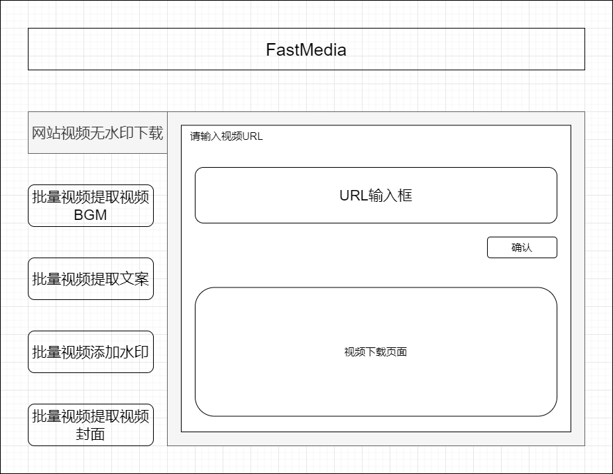

# FastMedia

🎬 **FastMedia** is a powerful media processing platform built on Flask framework, providing comprehensive video processing services. It supports multi-platform video downloading, BGM extraction, and thumbnail generation.

## ✨ Core Features

### 🎥 Batch Video Download (Watermark-Free)
- **Multi-platform Support**: Douyin, TikTok, Bilibili, YouTube, Twitter, Kuaishou, etc.
- **Batch Processing**: Quick download of multiple videos via comma-separated URL lists
- **Smart Parsing**: Automatic platform recognition and optimal download strategy selection
- **Quality Control**: Support for resolutions up to 720p, balancing quality and storage space

### 🎵 Batch Video BGM Extraction
- **High-Quality Audio**: 192kbps audio quality output
- **Format Support**: Automatic selection of optimal audio formats
- **Batch Processing**: Simultaneous BGM extraction from multiple videos
- **Platform Compatibility**: Support for all mainstream video platforms


### 🖼️ Batch Video Thumbnail Extraction
- **Multiple Modes**: Support for extracting first frame or specific timestamp frames
- **Standard Size**: 320x180 (16:9 ratio) high-quality thumbnails
- **Format Optimization**: 90% quality JPEG format output
- **Batch Generation**: Process multiple video thumbnails at once

## 🏗️ Technical Architecture

### Backend Tech Stack
- **Framework**: Flask 2.3.3 - Lightweight web framework
- **Video Processing**: yt-dlp - Powerful video download tool
- **Video Editing**: MoviePy - Video processing and editing
- **Image Processing**: Pillow - Python image processing library
- **Logging System**: loguru - Modern logging
- **HTTP Requests**: requests - Simple HTTP library
- **CORS Support**: Flask-CORS - Cross-origin resource sharing
- **Environment**: python-dotenv - Environment variable management

### Core Service Modules
- `VideoDownloader` - Video download service
- `BGMExtractor` - BGM extraction service
- `ThumbnailExtractor` - Thumbnail extraction service
- `KuaishouDownloader` - Kuaishou-specific downloader

## 🚀 Quick Start

### Requirements
- Python 3.8+
- Operating System: Windows/Linux/macOS

### Installation Steps

1. **Clone the Project**
```bash
git clone https://github.com/your-username/FastMedia.git
cd FastMedia
```

2. **Install Dependencies**
```bash
pip install -r requirements.txt
```

3. **Start the Service**
```bash
python run.py
```

4. **Access the Application**
Open your browser and visit: `http://localhost:5000`

### Configuration

The project supports multi-environment configuration, adjustable in `config.py`:

- **Development Environment**: `DevelopmentConfig`
- **Production Environment**: `ProductionConfig`
- **Testing Environment**: `TestingConfig`

## 📱 Web Interface

FastMedia provides a clean and modern web interface, inspired by Notion's design:



### Interface Modules

#### 📥 Task Input Area
- **Function Selection**: Dropdown menu for processing type selection (Download/BGM/Thumbnail)
- **URL Input**: Multi-line text box supporting batch URL list pasting
- **Parameter Configuration**: Dynamic display of relevant configuration options based on selected function

#### ⚙️ Advanced Settings
- **Output Path**: Custom file save location
- **Concurrency Control**: Maximum 3 concurrent download tasks
- **Timeout Settings**: 5-minute download timeout protection
- **Log Level**: INFO/DEBUG level selection

#### 📊 Task Status Area
- **Real-time Progress**: Display success/failure/total statistics
- **Error Details**: Detailed error information for failed tasks
- **Result Downloads**: Download links for processed files

#### 📋 History Records
- **Task Tracking**: Task ID, time, function type records
- **Result Preview**: Quick preview of processing results
- **Filter Function**: Filter history records by time or function type

## 🔌 API Endpoints

FastMedia provides RESTful API endpoints for programmatic access:

### Video Download
```http
POST /api/download_videos
Content-Type: application/json

{
  "urls": "https://example.com/video1,https://example.com/video2"
}
```

### BGM Extraction
```http
POST /api/extract_bgm
Content-Type: application/json

{
  "urls": "https://example.com/video1,https://example.com/video2"
}
```


### Thumbnail Extraction
```http
POST /api/extract_thumbnail
Content-Type: application/json

{
  "urls": "https://example.com/video1",
  "timestamp": "00:00:05"
}
```

## 🌐 Supported Platforms

| Platform | Domain | Status | Special Notes |
|----------|--------|--------|---------------|
| Douyin | douyin.com | ✅ Supported | Watermark-free download |
| TikTok | tiktok.com | ✅ Supported | International version |
| Bilibili | bilibili.com, b23.tv | ✅ Supported | Short link support |
| YouTube | youtube.com, youtu.be | ✅ Supported | Multi-resolution options |
| Twitter/X | twitter.com, x.com | ✅ Supported | Videos and GIFs |
| Kuaishou | kuaishou.com | ✅ Supported | Dedicated parser |

## 📁 Directory Structure

```
FastMedia/
├── app.py                 # Flask application main file
├── config.py             # Configuration file
├── requirements.txt      # Dependencies list
├── run.py               # Startup script
├── utils.py             # Utility functions
├── services/            # Core service modules
│   ├── __init__.py
│   ├── video_downloader.py
│   ├── bgm_extractor.py
│   ├── thumbnail_extractor.py
│   └── kuaishou_downloader.py
├── static/              # Static resources
│   ├── css/
│   │   └── style.css
│   └── js/
│       └── main.js
├── templates/           # HTML templates
│   └── index.html
├── downloads/           # Downloaded files storage
│   ├── videos/
│   ├── bgm/
│   └── thumbnails/
└── logs/               # Log files
    └── fastmedia.log
```

## ⚠️ Important Notes

### Usage Limitations
- **Concurrency Limit**: Maximum 3 concurrent download tasks to avoid server overload
- **File Size**: Upload file limit of 100MB
- **Timeout Settings**: Single download task timeout of 5 minutes
- **Resolution Limit**: Video downloads limited to 720p and below for quality-storage balance

### Legal Disclaimer
- This tool is for educational and research purposes only
- Please comply with each platform's terms of service and copyright policies
- Downloaded content should not be used for commercial purposes
- Users are responsible for their own legal compliance

### Technical Limitations
- Some platforms may have anti-crawling mechanisms affecting download success rates
- Platforms like Kuaishou may require special handling (dedicated parser provided)
- Some private or restricted videos cannot be downloaded

## 🤝 Contributing

Welcome to submit Issues and Pull Requests to improve the project:

1. Fork this repository
2. Create a feature branch (`git checkout -b feature/AmazingFeature`)
3. Commit your changes (`git commit -m 'Add some AmazingFeature'`)
4. Push to the branch (`git push origin feature/AmazingFeature`)
5. Open a Pull Request

## 📄 License

This project is licensed under the MIT License - see the [LICENSE](LICENSE) file for details

## 📞 Contact

- Project Homepage: [GitHub Repository](https://github.com/your-username/FastMedia)
- Issue Reports: [Issues](https://github.com/your-username/FastMedia/issues)
- Email: your-email@example.com

---

⭐ If this project helps you, please give it a star!